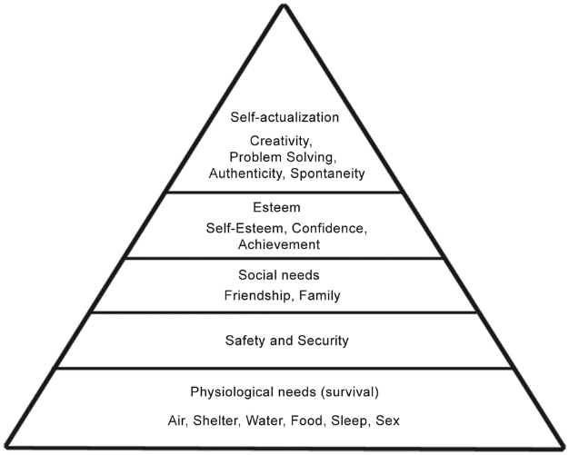

# Organisational theory and motivation

Organisational theory consists of approaches to organisational analysis. Organisations are groups of individuals that are structured and managed to meet a need, or to pursue collective goals.

Some well known approaches are:

* Maslows Hierarchy of needs
* Hetzberg

## Maslows Hierarchy of needs

## Hertzberg two factor model

* Proposed by Frank Hertzberg
* Asked people to describe situations when they felt really good and really bad about their jobs. 
* There are a set of factors in the workplace that cause satisfaction. 
* And a seperate set of factors that cause dissatisfaction. 
* Remedying the causes of dissatisfaction will not create satisfaction

### Job dissatisfaction

* Working conditions 
* Co-worker relations 
* Policies and rules 
* Supervisor quality 
* Base wage,salary

### Job satisfaction

* Achievement
* Recognition 
* Responsibility
* Work itself 
* Advancement 
* Personal growth

