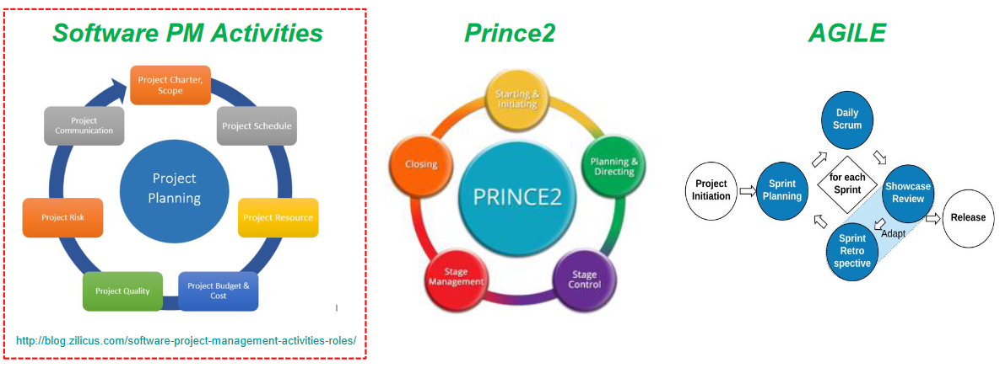

## Project initialisation

There are many approaches and methodologies that are widely used across industry with organisations
favoring standard industry ones (PRINCE2, PMBOK, Agile etc) or usually a modified version of these they make their own.

### Setting up a project for success. A business case is the key.

The purpose of the Business Case is to establish mechanisms to judge whether the project is (and remains) desirable,
viable and achievable as a means to support decision making in its initial and continued investment.

- Provides a factual base for key decision makers to decide if the project should be undertaken.
- Demonstrates how the project adds value to the organisation
- Has a set of pre-defined standard organisatinal characteristics (costs, benefit, risk, etc.)
- It is not all about size - size depends on the cost/benefit.
- It is a living document throughout the project that should be reviewed and signed off at key stages.

#### A business case contains

- Exec summary
- Reasons why its required
- Business options
- Expected benefits
- Expected dis-benefits
- Timescale
- costs
- Investment appraisal
- Major risks
